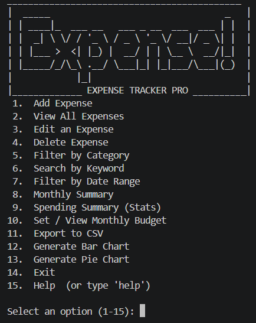
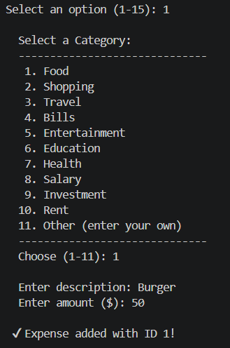
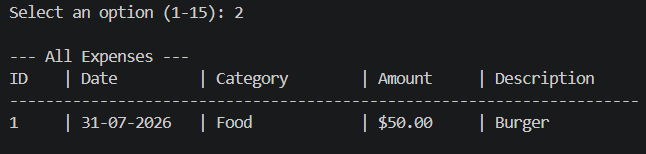
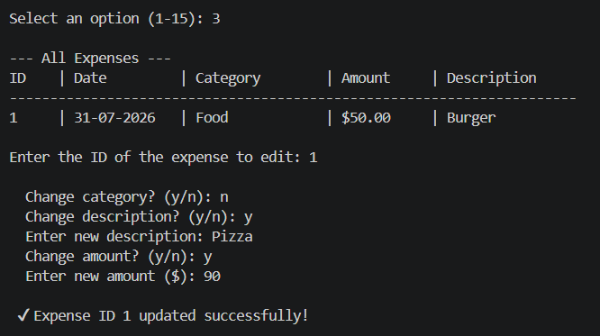
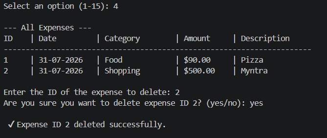
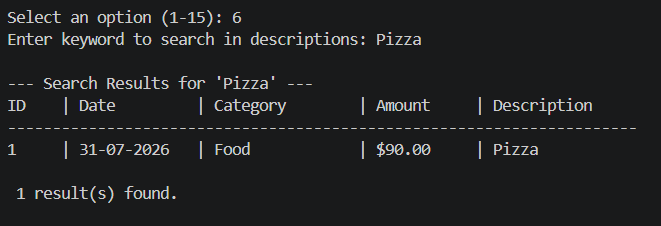
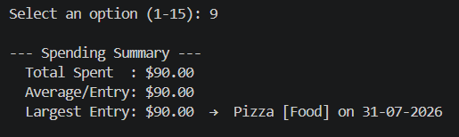
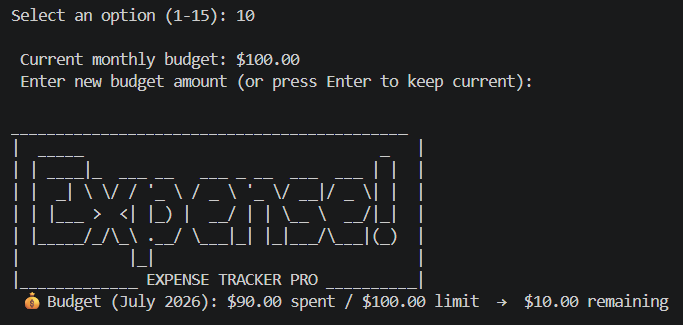
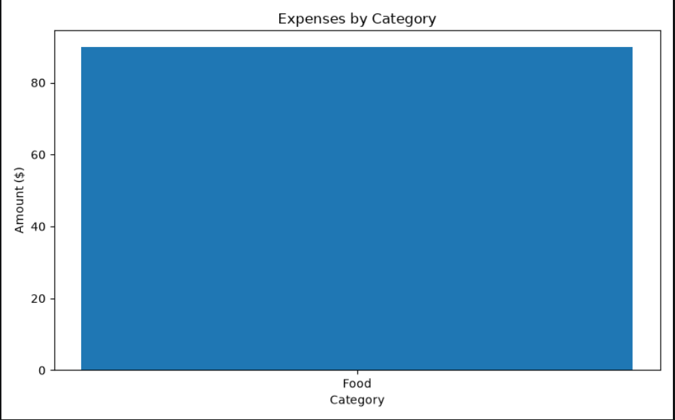
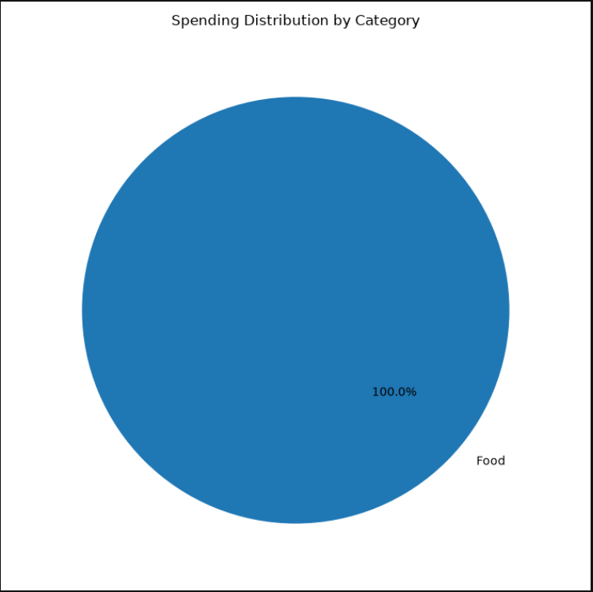

# Expense Tracker Pro

A feature-rich, professional Python CLI application designed for tracking personal expenses, setting and monitoring monthly budgets, performing detailed data filtering, and generating insightful visual reports (Bar & Pie charts).


---

## Table of Contents

- [Overview](#overview)
- [Key Features](#key-features)
- [Screenshots & Visual Walkthrough](#screenshots--visual-walkthrough)
- [Project Architecture](#project-architecture)
- [Directory Structure](#directory-structure)
- [Installation & Setup](#installation--setup)
- [Usage Guide](#usage-guide)
- [Dependencies](#dependencies)
- [Author](#author)
- [License](#license)

---

## Overview

**Expense Tracker Pro** brings modern financial logging and budget intelligence directly to your terminal. Built with a clean modular Python architecture and backed by SQLite3, it provides robust storage, audit history logging, smart budget warning alerts, and automated graphical charts via Matplotlib.

---

## Key Features

- **Full CRUD Expense Management**: Effortlessly add, view, edit, and delete expense entries with safety confirmations.
- **Visual Analytics**: Automatically generate and export high-resolution Bar Charts and Pie Charts categorizing spending.
- **Budget Tracker & Overspend Alerts**: Set monthly budget caps with automated real-time spending summaries and warning indicators when limits are exceeded.
- **Multi-Criteria Search & Filtering**: Filter transactions by pre-set/custom categories, date ranges (`DD-MM-YYYY`), or keyword search in descriptions.
- **Statistical Summaries**: View monthly breakdown totals, overall spending averages, and largest single transactions.
- **CSV Export & Audit Trail**: Export all financial records to `.csv` and log system events automatically into structured log and history files.

---

## Screenshots & Visual Walkthrough

### Main Menu & Dashboard
The main interactive menu displays real-time budget status alerts alongside clear navigation options.



---

### Add & View Expenses
Easily record expenses with customizable categories and view all entries in a formatted, tabular presentation with unique record IDs.

| Add Expense | View All Expenses |
| :---: | :---: |
|  |  |

---

### Edit & Delete Operations
Select records by ID to modify specific fields or remove expenses with built-in safety confirmation prompts.

| Edit Expense | Delete Expense |
| :---: | :---: |
|  |  |

---

### Search, Summaries & Budget Tracker
Filter transactions by keyword, analyze monthly spending statistics, and monitor your monthly budget limit.

| Search & Filter | Monthly Summary & Stats | Budget Management |
| :---: | :---: | :---: |
|  |  |  |

---

### Data Visualization (Charts)
Generate visual insights into your spending patterns with Matplotlib graphics.

| Category Bar Chart | Category Pie Chart |
| :---: | :---: |
|  |  |

---

## Project Architecture

The project follows clean object-oriented design principles and separation of concerns across multiple modules:

- **`app.py`**: CLI interaction layer handling user inputs, menu options, and UI rendering.
- **`tracker.py`**: Core domain module (`ExpenseTracker`) encapsulating business logic.
- **`database.py`**: Data access layer managing SQLite schema and SQL query execution.
- **`reports.py`**: Data processing module generating CSV exports and Matplotlib chart visualizations.
- **`config.py`**: Centralized configuration management for project directory paths.
- **`utils.py`**: Utility functions for logging (`app.log`), user history logging, and banner formatting.

---

## Directory Structure

```text
02-Expense-Tracker-Pro/
├── app.py                  # Main application CLI runner
├── tracker.py              # Core ExpenseTracker business logic
├── database.py             # SQLite database layer
├── reports.py              # CSV export & Matplotlib chart generation
├── config.py               # Centralized path configurations
├── utils.py                # Logging & history utilities
├── requirements.txt        # Project dependencies
├── README.md               # Project documentation
├── assets/
│   └── banner.txt          # Terminal ASCII banner
├── charts/                 # Output folder for generated charts
│   ├── category_bar.png
│   └── category_pie.png
├── database/
│   └── expenses.db         # SQLite persistent database
├── exports/
│   └── expenses.csv        # Exported CSV spreadsheets
├── history/
│   └── history.txt         # Audit trail history log
├── logs/
│   └── app.log             # Application system logs
└── screenshots/            # Visual documentation images
    ├── home.png
    ├── add-expense.png
    ├── view-expenses.png
    ├── edit-expense.png
    ├── delete-expense.png
    ├── search.png
    ├── summary.png
    ├── budget.png
    ├── bar-chart.png
    └── pie-chart.png
```

---

## Installation & Setup

### Prerequisites
- **Python 3.8** or higher installed on your machine.

### Step 1: Clone the Repository
```bash
git clone https://github.com/sanjansahdev/02-Expense-Tracker-Pro.git
cd 02-Expense-Tracker-Pro
```

### Step 2: Create a Virtual Environment (Optional but Recommended)
```bash
# Windows
python -m venv venv
venv\Scripts\activate

# macOS / Linux
python3 -m venv venv
source venv/bin/activate
```

### Step 3: Install Dependencies
```bash
pip install -r requirements.txt
```

### Step 4: Run the Application
```bash
python app.py
```

---

## Usage Guide

Upon launching the application, select from options **1 to 15**:

1. **Add Expense**: Pick a predefined category (Food, Bills, Travel, etc.) or type a custom one, enter description and amount.
2. **View All Expenses**: Display all recorded expenses in a clean table with IDs, dates, categories, amounts, and descriptions.
3. **Edit an Expense**: View expenses table, pick an ID, and selectively update category, description, or amount using interactive `(y/n)` prompts.
4. **Delete Expense**: View expenses table, select an expense ID, and confirm deletion.
5. **Filter by Category**: View total spending and transactions for a selected category.
6. **Search by Keyword**: Quick search across expense descriptions.
7. **Filter by Date Range**: View transactions between two `DD-MM-YYYY` dates.
8. **Monthly Summary**: Group total spending by month with a grand total.
9. **Spending Summary (Stats)**: Display total spent, average per entry, and largest single expense.
10. **Set / View Monthly Budget**: Define monthly spending limit and receive automated alerts when exceeding.
11. **Export to CSV**: Save all database records to `exports/expenses.csv`.
12. **Generate Bar Chart**: Render a category-wise spending bar chart saved in `charts/category_bar.png`.
13. **Generate Pie Chart**: Render a category spending distribution pie chart saved in `charts/category_pie.png`.
14. **Exit**: Gracefully quit the application.
15. **Help**: View quick-reference operational guide.

---

## Dependencies

- **[Matplotlib](https://matplotlib.org/)**: Used for rendering bar charts and pie charts.
- **SQLite3**: Embedded relational database engine (built into Python standard library).
- **CSV & Logging**: Native Python standard modules for data export and logging.

---

## Author

**Sanjan Sah**
- GitHub: [@sanjansahdev](https://github.com/sanjansahdev)

---

## License

This project is licensed under the **MIT License**. Feel free to use, modify, and distribute it for personal or commercial projects.
